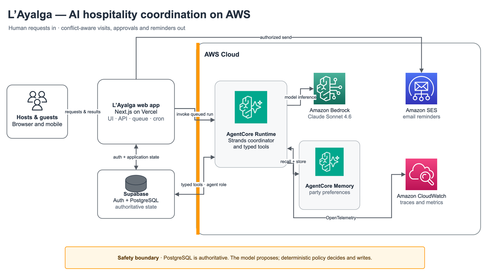

# Building Everyday Agents That Truly Simplify Life

This weekend, I’m submitting my newest project, [L’Ayalga](https://layalga.thecreativetoken.com) (Asturian for "a treasure found"), to the [AWS Agents for Humans hackathon](https://agentsforhumans.devpost.com/) in the Everyday Agents category. Inspiration for this idea came from my own experience trying to coordinate with my wife year-round friends and family visits to our home.

L’Ayalga coordinates visits to shared homes. Hosts invite, guests choose suitable rooms, and everyone can track changes, requests and follow-up.

But the bigger idea is not about guest rooms. It is about how agents can become useful in everyday life.

Daily coordination is difficult because information is scattered, plans change constantly and people share responsibility. Some decisions also depend on context that software should not guess. An everyday agent should understand informal requests, check facts, complete routine work and know when to ask a person.

## A simple division of responsibility

The design principle behind L’Ayalga is:

**The agent interprets. Code enforces the rules. People keep the judgment that matters.**

Imagine a message such as: “Could we come next weekend with the children?” The agent can understand the request and prepare the next steps. Software checks dates, rooms, capacity and household rules.

There are three useful outcomes: proceed, decline or ask a person.

Routine work continues. Impossible requests stop. Social exceptions go to a host with a clear explanation.

Human approval is not a magic override. If a room becomes occupied or a rule changes while someone is deciding, the system checks the current situation again. An old “yes” cannot force an action that is no longer valid. I explored this boundary in more detail in an earlier article about [deterministic household policy under a Strands agent](https://builder.aws.com/content/3JDQAfyHGB6qjJ0jAxwcnaCdRUk/agents-for-humans-deterministic-household-policy-under-a-strands-agent).

## The agent should finish the job

Everyday work continues after the first action. Plans need confirmation. Unanswered questions need to return to the right person. An agent can carry context across time, [resume after a human decision](https://builder.aws.com/content/3JDQsaSl4Yucs12mbJpXOyRCj5b/agents-for-humans-durable-interrupts-for-household-decisions) and [follow through](https://builder.aws.com/content/3JDR9dE9hJBcB4SItqBUl0GqL01/agents-for-humans-testing-proactive-follow-through-with-an-honest-clock) until the process reaches a clear outcome.

## Tech stack: the AWS foundation

[L’Ayalga](https://github.com/juan294/layalga) integrates several [**AWS cloud services**](https://aws.amazon.com/) to create a secure, serverless runtime, persistent household memory and an observability pipeline for its AI agent. The [Strands Agents TypeScript SDK](https://strandsagents.com/docs/user-guide/quickstart/typescript/) connects these services through typed tools, durable human interruption and resumable sessions.

### **Key AWS components and their value**

#### **1. [Amazon Bedrock](https://docs.aws.amazon.com/bedrock/): model runtime**

- **Components used:** [Claude Sonnet](https://www.anthropic.com/claude/sonnet) 4.6 in production, with Claude Sonnet 4.5 retained as an earlier verified model, accessed through the [Amazon Bedrock Converse API](https://docs.aws.amazon.com/bedrock/latest/userguide/conversation-inference-call.html). **For some reason my account can’t get access to Sonnet 5 via Bedrock. AWS folks, what’s up with that?**
- **Value added:** Bedrock provides the language intelligence. It helps interpret informal invitations, rescheduling requests and bilingual follow-up, then supplies structured arguments to typed tools. It cannot bypass the deterministic rules for bookings, rooms or household policy.

---

#### **2. [Amazon Bedrock AgentCore Runtime](https://docs.aws.amazon.com/bedrock-agentcore/latest/devguide/agents-tools-runtime.html)**

- **Components used:** The AgentCore direct-code [Node.js 22](https://nodejs.org/en) runtime `layalga_agent-mONXXjFms4`, managed with the [AWS CLI](https://aws.amazon.com/cli/) [`bedrock-agentcore-control`](https://docs.aws.amazon.com/cli/latest/reference/bedrock-agentcore-control/) commands.
- **Value added:** AgentCore is the cloud execution environment for the Strands TypeScript agent. It processes queued agent tasks, keeps each claimed invocation open until the run settles and connects to PostgreSQL through the restricted, non-owner `layalga_agent` role. The [runtime and database identity design](https://github.com/juan294/layalga/blob/main/docs/release/runtime-database-and-identity.md) separates agent execution from the web application’s database authority.

---

#### **3. [Amazon Bedrock AgentCore Memory](https://docs.aws.amazon.com/bedrock-agentcore/latest/devguide/memory.html)**

- **Components used:** The `LayalgaHouseholdMemory-CBgKZc7mK4` memory resource, with `HouseholdPreferences` and `HouseholdFacts` [long-term memory strategies](https://docs.aws.amazon.com/bedrock-agentcore/latest/devguide/long-term-memory-long-term.html). Raw events expire after 30 days; extracted long-term records remain until a host erases them.
- **Value added:** Memory can recall useful party preferences across visits, such as ground-floor, room or bed preferences. The system uses this recall to rank room combinations that are already feasible. It excludes family names and raw host-capture conversations, and memory can never change capacity, availability, consent or policy.

---

#### **4. [Amazon S3](https://aws.amazon.com/s3/)**

- **Components used:** The [versioned](https://docs.aws.amazon.com/AmazonS3/latest/userguide/Versioning.html) `layalga-agent-bundles-106403001709` bucket stores packaged AgentCore deployment artifacts through L’Ayalga’s [deployment script](https://github.com/juan294/layalga/blob/main/scripts/deploy-agentcore.sh).
- **Value added:** Versioned artifacts make each agent release identifiable. AgentCore can [update from a specific S3 object version](https://docs.aws.amazon.com/cli/latest/reference/bedrock-agentcore-control/update-agent-runtime.html), and operators can restore a previous bundle when a rollback is required.

---

#### **5. [AWS Identity and Access Management](https://docs.aws.amazon.com/iam/)**

- **Components used:** The `layalga-agentcore-runtime` execution role, repository-managed [runtime](https://github.com/juan294/layalga/blob/main/infra/iam/agentcore-runtime-execution.json) and [memory](https://github.com/juan294/layalga/blob/main/infra/iam/memory-data-plane.json) policies, and the `layalga-web` identity with [permission to invoke the specific AgentCore runtime](https://github.com/juan294/layalga/blob/main/infra/iam/web-bedrock-policy.json).
- **Value added:** IAM keeps responsibilities separate. The web application can dispatch agent work without managing the runtime, while the agent uses a database role without owner or administrative schema privileges. Memory access is restricted to the project’s single memory resource.

---

#### **6. [AWS Distro for OpenTelemetry](https://aws-otel.github.io/), [CloudWatch](https://aws.amazon.com/cloudwatch/) and [AWS X-Ray](https://aws.amazon.com/xray/)**

- **Components used:** AWS Distro for OpenTelemetry automatic instrumentation, AgentCore CloudWatch log groups, [CloudWatch Transaction Search](https://docs.aws.amazon.com/AmazonCloudWatch/latest/monitoring/CloudWatch-Transaction-Search.html) and X-Ray tracing.
- **Value added:** The observability pipeline separates model time from tool execution, records token use and helps diagnose failed or slow runs. The [documented production trace](https://github.com/juan294/layalga/blob/main/docs/submission/assets/agentcore-trace.png) used 100% sampling and captured one host-invitation run with 10,538 total tokens. That is evidence from one traced operation, not a general token average.

---

#### **7. [Amazon Simple Email Service](https://aws.amazon.com/ses/)**

- **Components used:** Amazon SES, a [web-owned email outbox](https://github.com/juan294/layalga/blob/main/src/core/notifications/email-outbox.ts) and restricted delivery policies.
- **Value added:** SES sends host decision and escalation notifications outside the agent’s tool authority. Verified, consenting guest reminders and return links use a separate outbox that the agent cannot read. That guest delivery path is implemented, but its [production IAM activation and real-recipient verification](https://github.com/juan294/layalga/blob/main/docs/release/guest-email-readiness.md) remain pending. Provider acceptance is not treated as proof of inbox delivery or a guest reply.

The rest of the application uses [Next.js](https://nextjs.org/) and [TypeScript](https://www.typescriptlang.org/) on [Vercel](https://vercel.com/). [PostgreSQL](https://www.postgresql.org/) through [Supabase](https://supabase.com/) remains the source of truth for rooms, bookings, policy, decisions and workflow state.

The stack is specific to this project. The principle is more general: use the model where language and adaptation help, use deterministic systems where correctness matters, and keep people in control of consequential judgment.

The same pattern can support family travel, appointments, care routines, shared purchases or household maintenance. The agent handles language and follow-through. Reliable software protects facts and permissions. People decide the exceptions.

That is the kind of agent I want in everyday life: one that removes coordination work, respects clear boundaries and follows through.

L’Ayalga is my attempt to make that idea concrete.
