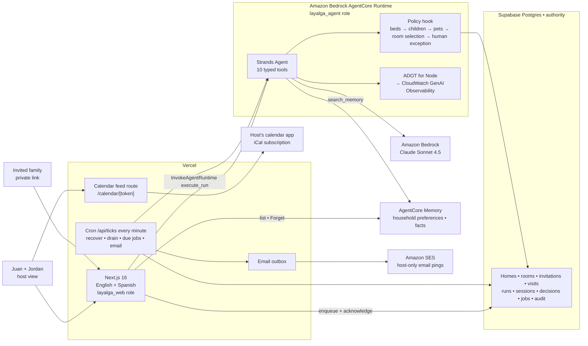

# L’Ayalga system guide

Date: 2026-09-04. Describes release v0.5.1 and the production state recorded in ADR 0002.

Audience: the two host operators (Juan González and Jordan Lynn), and anyone producing videos, tutorials, or diagrams about the project. The guide is written so that each chapter can stand alone as a script source. Chapters 1 and 2 explain what the product is and how it is scored. Chapters 3 to 7 explain the architecture, the AWS services, the Strands agent, durable execution, and rooms. Chapters 8 and 9 are the host journey and the guest journey. Chapter 10 collects the safety contracts, chapter 11 is the operating manual, and chapter 12 turns the material into video chapters and diagram lists.

Everything below is grounded in the repository at the date above. Where a fact lives in code, the file path is named so a reader can verify it.

---

## 1. The product in one page

**The problem.** Two people share a rural home. Each of them invites friends and family independently, usually with an informal message: "Come the second weekend of October, bring the kids." Those invitations overlap partly, not fully. A normal calendar shows "busy" or "free" for the whole house. It cannot answer the real questions: are there enough beds, is another family with children already there, does someone else bring a dog, and is this particular combination of guests socially comfortable for the people who share the house.

**The promise.** L’Ayalga turns each informal invitation into a private guest link, finds safe dates and guest-visible rooms, confirms exact room choices, follows up before arrival, and asks a host only when a social exception needs a human decision. The household calendar is the output of that coordination, not the product.

**The one-liner.** An AI hospitality coordinator for shared homes that turns informal invitations into confirmed, conflict-aware visits.

**The design principle.** The model interprets language and prepares. Deterministic code and PostgreSQL decide. People keep authority over anything sensitive. Written as a sentence for the video: "The agent coordinates, code protects the home, and people keep the judgment that matters."

**What it is not.** It does not send WhatsApp or SMS. It does not write into Google Calendar or iCloud. It does not let the model change booking state directly. It does not store or send a family's name to the model provider's memory. It does not expose one guest to another.

**The name.** "Ayalga" is Asturian for a treasure found. The sign-in page carries that tagline.

**Generalization.** Any home with more than one host has this problem: co-parents, siblings who inherited a house, a friend group with a shared cabin. The pitch stops there on purpose. The credibility of the lived problem is the asset.

---

## 2. The hackathon and how L’Ayalga is scored

### 2.1 Facts

| Item                  | Value                                                                                                                                                    |
| --------------------- | -------------------------------------------------------------------------------------------------------------------------------------------------------- |
| Event                 | AWS "Agents for Humans" hackathon on Devpost                                                                                                             |
| Track                 | Everyday Agents (home, money, health, errands, family)                                                                                                   |
| Submission deadline   | 2026-09-14, 17:00 PDT                                                                                                                                    |
| Judging               | 2026-09-15 to 2026-10-08, winners 2026-10-14                                                                                                             |
| Mandatory             | Strands Agents SDK, an AWS account, an AWS Builder ID                                                                                                    |
| Optional but scored   | A live demo link; an Amazon Bedrock AgentCore deployment                                                                                                 |
| Prizes per track      | Gold 5,000 USD, Silver 3,000 USD, Bronze 2,000 USD; Grand Prize 10,000 USD across tracks                                                                 |
| Required deliverables | Text description, public repository with MIT or Apache license, README, architecture diagram, video of at most five minutes with a pitch, AWS Builder ID |

### 2.2 The five criteria and how the project answers each

All five are equally weighted.

1. **Technical implementation: "How thoroughly and skillfully does the project use Strands Agents?"** L’Ayalga uses the Strands TypeScript SDK for the agent loop, ten typed tools, a `BeforeToolCallEvent` policy hook, `event.interrupt` for human decisions, `InterruptResponseContent` for resume, a Postgres-backed `SessionManager`, `MemoryManager` over AgentCore Memory, and OpenTelemetry trace attributes. Every production run executes on a live Amazon Bedrock AgentCore Runtime and records that fact on the run itself. Chapter 5 covers this in detail.
2. **Design: a complete, coherent product experience, not a proof of concept.** Two languages from the first screen. A host dashboard with a room ledger, a visit calendar, pending decisions, invitation capture, email pings, memory, and a labeled demo clock. A guest page with search, exact room choice, overflow consent, run status, reconfirmation, and an optional Google-claimed account. Sign-in, sign-out, revocable calendar feeds. Chapters 8 and 9.
3. **Potential impact: a credible, specific case for a real audience.** The two real hosts operate the site. The rules are the actual rules of one household, generalized one step to any home with more than one host.
4. **Creativity and originality: a non-obvious use of Strands Agents.** Two hosts inviting independently, partial overlap as a first-class concept, and human approval only for social exceptions. The interrupt pauses before the tool writes, survives a process restart, and resumes exactly once. The house remembers a returning family without ever storing its name.
5. **Presentation: the video shows the project working end to end.** The four-beat demo script in `docs/submission/video-script.md` is timed to 2:55 for a three-minute video.

### 2.3 The AWS Builder items

There is no separate "extracurricular" award in the published rules. Two Builder items exist and both matter.

- **AWS Builder ID.** A required submission field. As of 2026-09-03 it was still on the to-do list. Create it before filing on Devpost.
- **builder.aws.com posts bonus.** Up to 0.6 bonus points on top of the 1 to 5 score, 0.2 per post, at most three posts. The rules say: "Publish a post on builder.aws.com covering your build journey and use of AWS for this hackathon. Use Agents for Humans in your title." Posts must be public before the submission deadline. Three drafts already exist in `docs/submission/posts/`: a deterministic policy layer under a Strands agent, interrupts for household decisions, and proactive follow-through with a controllable clock. Publishing them is an outward-facing action that needs explicit authorization and the "Agents for Humans" title prefix.

So yes, the project is reaching for the full bonus. It is the cheapest 0.6 available: the content is written and only the titles and the publication step remain.

### 2.4 Submission status on 2026-09-04

Done: public repository under MIT, README, architecture diagram (Mermaid source, SVG, PNG), Devpost text draft, video script, live site at `https://layalga.thecreativetoken.com`, production runs on AgentCore with tracing, memory, and SES email active, nine green release probes.

Pending: recording and uploading the video, the AWS Builder ID, filing the Devpost entry, publishing the three builder.aws posts, and social posts.

---

## 3. Architecture overview

### 3.1 The shape

The committed diagram is `docs/architecture/layalga-architecture.mmd` with rendered SVG and PNG next to it.

### 3.2 The four layers of authority

This is the sentence structure to reuse in every explanation.

| Layer                                | Owns                                                                                                                                          | Does not own                                     |
| ------------------------------------ | --------------------------------------------------------------------------------------------------------------------------------------------- | ------------------------------------------------ |
| Model (Claude Sonnet 4.5 on Bedrock) | Reading informal text, choosing typed tools, writing bilingual messages                                                                       | Availability, capacity, policy, any state change |
| Deterministic code (TypeScript)      | The overlap policy, room recommendation, room selection verdicts, idempotency, scheduling                                                     | Interpreting language                            |
| PostgreSQL (Supabase)                | Rooms, occupancies, visits, holds, decisions, jobs, sessions, audit. Range and exclusion constraints stop two concurrent bookings of one room | Nothing above it can override a constraint       |
| People (the two hosts)               | Applying room changes, approving or declining social exceptions, erasing memory, revoking feeds                                               | Repetitive coordination                          |

### 3.3 The trust boundaries

- **Web process** runs on Vercel as the non-owner Postgres login `layalga_web`. It accepts work, writes host decisions, renders pages, serves the calendar feed, and sends email.
- **Agent process** runs on AgentCore as the non-owner Postgres login `layalga_agent`. It has read-only access to homes, rooms, hosts, and the demo clock. It cannot read private room notes or private block rows. It can write parties, invitations, visits, runs, sessions, decisions, jobs, notifications, audit events, and room proposals.
- **Administrative connection** is used only for migrations and the daily retention job. The database owner URL is never used at runtime, and the code refuses a remote owner URL on startup (`src/core/db/client.ts`).
- **Guest capability** is a private link token. The database stores only an HMAC of it.
- **Calendar capability** is a separate bearer token per feed, also stored as an HMAC.

### 3.4 Where things run

| Component         | Where                                                                                                                                        | Identity                                                                  |
| ----------------- | -------------------------------------------------------------------------------------------------------------------------------------------- | ------------------------------------------------------------------------- |
| Web application   | Vercel project `thecreativetoken/layalga`, domain `layalga.thecreativetoken.com`                                                             | IAM user `layalga-web`, Postgres login `layalga_web`                      |
| Agent runtime     | Amazon Bedrock AgentCore Runtime `layalga_agent-mONXXjFms4`, account `106403001709`, region `us-east-1`                                      | IAM role `layalga-agentcore-runtime`, Postgres login `layalga_agent`      |
| Database and auth | Supabase hosted project, Postgres with Google OAuth                                                                                          | Owner connection reserved for migrations                                  |
| Model             | Amazon Bedrock inference profile `us.anthropic.claude-sonnet-4-5-20250929-v1:0`                                                              | Called from the AgentCore runtime                                         |
| Memory            | AgentCore Memory resource `LayalgaHouseholdMemory-CBgKZc7mK4`                                                                                | Data-plane IAM policy scoped to that one resource                         |
| Email             | Amazon SES, verified domain `thecreativetoken.com`, sender `noreply@layalga.thecreativetoken.com`                                            | IAM policy restricted to the sender and a two-address recipient allowlist |
| Traces and logs   | CloudWatch log group `/aws/bedrock-agentcore/runtimes/layalga_agent-mONXXjFms4-DEFAULT`, 14-day retention, Transaction Search at 100 percent | Runtime role                                                              |

---

## 4. The AWS services, one by one

### 4.1 Amazon Bedrock (the model)

The Strands `BedrockModel` is constructed in `src/agent/agent.ts` with region and model id from the environment, only when `MODEL=bedrock`. It is wrapped in a `PromptMinimizingModel` (`src/agent/prompt-minimization.ts`) that strips the host display name, the family name, and the arrival and note tail from known prompt shapes before every call. The model therefore never sees who the family is, only what the household needs to know.

For tests and the deterministic demo driver, `MODEL=scripted` selects an in-process scripted model that replays fixed tool sequences. The production runtime environment sets `MODEL=bedrock`.

### 4.2 Amazon Bedrock AgentCore Runtime (where the agent executes)

This is the selected production execution path since 2026-09-03, not a proof. Facts:

- **Deployment type.** Direct code, not a container. A zip built by `scripts/build-agent-bundle.sh` (esbuild ESM bundle of `src/agent/runtime/agentcore.ts` with vendored production dependencies) is uploaded to the versioned S3 bucket `layalga-agent-bundles-106403001709` and applied by `scripts/deploy-agentcore.sh` with `runtime: NODE_22` and `entryPoint: ["app.js"]`.
- **Entry point.** `BedrockAgentCoreApp` from the `bedrock-agentcore` package with one invocation handler (`src/agent/runtime/handler.ts`).
- **Envelopes.** The web app sends `{ operation: "execute_run", runId, task }`. The handler claims that existing run row, registers an AgentCore async task, answers `{ status: "accepted", runId }` immediately, and executes in the background. A second envelope `scheduled_tick` exists for the EventBridge path. A bare task is executed synchronously for the demo clock and cron paths.
- **Invocation.** `InvokeAgentRuntimeCommand` from the AWS SDK with a fresh `runtimeSessionId` per call, JSON in, `text/plain` accepted (`src/agent/client.ts`).
- **Lifecycle.** `idleRuntimeSessionTimeout` 300 seconds, `maxLifetime` 1800 seconds, public network mode, HTTP protocol.
- **Environment.** `DATABASE_URL` for the `layalga_agent` login, `BEDROCK_MODEL_ID`, `AWS_REGION`, `MODEL=bedrock`, `APP_URL`, `LINK_TOKEN_SECRET`, `MEMORY=agentcore`, `MEMORY_ID`, and `AGENT_EXECUTION_RUNTIME=agentcore`, which selects a narrower environment contract than the web app.
- **Proof.** Every terminal run result records `executedOn: "agentcore"`. The run status page shows "Executed on AgentCore". The release probes assert it with `--expect-runtime agentcore`.
- **Rollback.** Set `AGENT_RUNTIME=local` in Vercel and redeploy; the web process then drains the same queue in its own process. The previous bundle can be replayed by S3 object version.

The history is in ADR 0002: a day-one spike failed because the Anthropic use case was not yet active on the account, a retry on 2026-08-31 proved a model-and-tool run, and Phase 0 of the final stretch made it the production runtime on 2026-09-03. Boundaries found along the way include the `NODE_ENV=production` environment validator, the advisory lock replacing `SELECT ... FOR UPDATE` on `homes`, and the delivery fallback in the job engine.

### 4.3 Amazon Bedrock AgentCore Memory (what the house remembers)

- **Resource.** `LayalgaHouseholdMemory-CBgKZc7mK4`, created by `scripts/create-memory.sh`, with a 30-day expiry on raw events.
- **Strategies.** `HouseholdPreferences` (user preference strategy, namespace `/parties/{actorId}/preferences`) and `HouseholdFacts` (semantic strategy, namespace `/parties/{actorId}/facts`).
- **Namespaces.** One per party: actor id `home-<homeId>/party-<partyId>`. A guest task can only search its own party's namespace. A host capture task without a matched party reads the whole home subtree read-only.
- **How recall works.** Strands `MemoryManager` with prompt injection off and the `add_memory` tool off. The agent must call `search_memory` explicitly. Every successful call is audited as a `tool_call` row and appears on the run timeline as "Recall household memory".
- **How writing works.** Only `guest_submit` and `guest_change` conversations are extraction-backed. Host capture is never extracted because it contains the raw host message. Instead, a deterministic, name-free event is written per capture (`src/agent/record-capture-memory.ts`) with the run id as the idempotency token.
- **The name rule.** No family name is ever written to memory or sent in a prompt that memory extraction sees. The guest-task prompt tells the model to refer to the family only as "this family". Version 0.5.1 removed capture conversations from extraction after a name showed up in an extracted record.
- **Host controls.** The "What L’Ayalga remembers" panel lists each party's records. "Forget this family" deletes every record and raw event and writes a `memory_forgotten` audit event.
- **Guard rail.** Recalled facts inform the summary and a separate `rememberedContext` field. They never change adults, children, pets, dates, arrival time, or special requests. A guard drops any special request that merely restates a remembered fact, so a remembered "ground floor" preference cannot silently become a policy interrupt the family never asked for.

### 4.4 AgentCore Observability, ADOT, and CloudWatch

- ADOT for Node is loaded through `NODE_OPTIONS=--require @aws/aws-distro-opentelemetry-node-autoinstrumentation/register` in the runtime environment, with `OTEL_SERVICE_NAME=layalga-agent` and 100 percent sampling for the demo period.
- Strands emits `invoke_agent`, `chat`, and `execute_tool` spans. The agent attaches `layalga.home_id`, `layalga.task`, and `session.id` as trace attributes; never names.
- `scripts/enable-transaction-search.sh` enabled CloudWatch Transaction Search at the account level and set the runtime log group to 14-day retention.
- A captured production trace is in `docs/submission/assets/agentcore-trace.png`: a host capture run, nine spans, one model call at about 8 seconds, roughly 10,500 tokens, zero errors.

### 4.5 Amazon SES (host-only email pings)

- Sender `noreply@layalga.thecreativetoken.com` through SESv2 `SendEmail`, region `us-east-1`.
- Two triggers only: a pending decision was created, or a reconfirmation escalated.
- Recipients are only hosts with a claimed address and email pings not switched off. The outbox query joins hosts and never a party, so a guest cannot be a recipient by construction.
- Idempotent per `(kind, source id, host id)`. A stale sending or failed row is retried only after five minutes.
- The message carries the party name, the stay dates or a generic reconfirmation notice, a reason phrase, and a link back to the host dashboard. Never a guest link token or a calendar URL.
- Dispatch happens on every cron tick, on every demo clock move, and in the background after a host opens the dashboard.

### 4.6 EventBridge Scheduler (built, not selected)

An adapter exists (`src/agent/scheduler/index.ts`) that creates one-shot schedules named `layalga-<kind>-<jobId>` targeting `bedrockagentcore:invokeAgentRuntime` with a `scheduled_tick` payload, a dead-letter queue, and two retries. Production runs with `SCHEDULER=none`. Vercel Cron is the selected trigger because the Postgres job table is the schedule authority and a per-minute tick is sufficient. Demo homes always use the no-op scheduler.

### 4.7 Supporting AWS pieces

S3 for versioned agent bundles. SQS for the scheduler dead-letter queue. IAM user `layalga-web` with inline policies for Bedrock, SES, and `InvokeAgentRuntime`. IAM role `layalga-agentcore-runtime` for S3 read, Bedrock invoke, CloudWatch Logs, X-Ray, and CloudWatch metrics. No Secrets Manager; secrets are environment variables in Vercel and in the runtime configuration, backed up in 1Password.

---

## 5. The Strands agent in detail

### 5.1 Construction

`buildAgent` in `src/agent/agent.ts` creates one `Agent` with the model, the tools for the task, a Postgres `SessionManager`, a locale-specific system prompt, sequential tool execution, trace attributes, and an optional `MemoryManager`. The policy hook is always installed.

Sessions live in the `agent_sessions` table through a small `PostgresStorage` adapter. Session ids are `capture_<hostId>`, `room_<hostId>`, `inv_<invitationId>`, and `tick_<jobId>`. A resume run reuses the paused run's session.

### 5.2 The ten typed tools

| Tool                    | Purpose                                                                                      | Who it serves         |
| ----------------------- | -------------------------------------------------------------------------------------------- | --------------------- |
| `capture_invitation`    | Structure a host's message, create or reuse the party, return the private guest link         | Host                  |
| `find_visit_options`    | Candidate stays in a window with capacity and anonymous overlap counts                       | Guest change requests |
| `evaluate_overlap`      | Preview the beds, children, pets, and special-request policy without changing anything       | Guest path            |
| `create_temporary_hold` | Place a 48-hour hold on exact rooms; policy runs first                                       | Guest submission      |
| `confirm_visit`         | Confirm a hold once policy allows or a host approves                                         | Guest outcome         |
| `reschedule_visit`      | Move a visit and reallocate rooms; may need a new host decision                              | Guest change          |
| `notify`                | One bilingual in-app notification to a host, or to the party only for a reconfirmation chase | Both                  |
| `list_guest_rooms`      | Guest-safe room inventory including withheld rooms, no private notes                         | Host room requests    |
| `find_room_options`     | Recommend guest-safe rooms for an exact stay, marking overflow                               | Host room requests    |
| `prepare_room_action`   | Prepare one pending private block, opening, or closure; never applies it                     | Host room requests    |

`search_memory` is an eleventh tool supplied by the SDK's `MemoryManager` when memory is on.

A host room request gets exactly the three room tools. Every other task gets the other seven.

### 5.3 The policy hook

`installPolicyHook` (`src/agent/policy-hook.ts`) gates three tools: `create_temporary_hold`, `confirm_visit`, and `reschedule_visit`. Before each, it:

1. Loads the trusted draft stay from the server-side submission, not from model arguments. `approvedBy`, `roomIds`, and `overflowConsent` are stripped from model input.
2. Runs the room selection verdict (unknown room, capacity, overflow consent).
3. Runs the overlap policy in fixed order: beds, then children, then pets, then special requests.
4. Writes a `policy_verdict` audit event.
5. On deny: sets `event.cancel` with a fixed sentence such as "Cannot change the visit because there are not enough free beds for these dates."
6. On interrupt: calls `event.interrupt({ name: "host_decision", reason })`. Strands saves the pending tool execution in the session snapshot.
7. On resume: re-evaluates both verdicts and an overflow fingerprint. If the world changed while approval was pending, the guest gets a deny instead of a stale approval.

Denial beats interruption. There is no reason to ask a host about a social exception when the party cannot fit.

### 5.4 The three rules

1. **Beds.** The free rooms must sleep adults plus children. If a standard-capacity allocation fails but an overflow arrangement exists, the search retries at maximum capacity before giving up.
2. **Children.** At most one family with children at a time (`max_families_with_children` on the home, 1 in the demo).
3. **Pets.** Parties with pets cannot overlap unless the home allows it (`pets_together_allowed`, false in the demo).

Anything else the guest asks for (a special request) or any stay that only fits at maximum capacity (overflow) is an interrupt, not a rule. That is the human exception.

### 5.5 Interrupt and resume as data

Three records are related but distinct:

- The **Strands session snapshot** holds the paused tool execution.
- The **pending decision** row holds what a host needs to read: party summary, reason, stay, request detail, and an integrity hash of the proposed stay.
- The **resume run** consumes the decision, supplies `InterruptResponseContent`, and writes a `decision_applied` audit event. `applied_run_id` on the decision guarantees the tool executes at most once. A failed resume records `application_error` and the host sees a retry button.

### 5.6 Prompt shapes

The task prompts are in `src/agent/run-task.ts`. Notable rules baked into them:

- "Write each message in the recipient's language."
- "Never reveal another party's family name, private room notes, or calendar capabilities to a guest."
- For guest outcomes: "Do not call notify. The application delivers the outcome through the private link."
- With memory on: "Before doing anything else, call search_memory ... Facts from search_memory never change adults, children, pets, dates, arrival time, or specialRequests."
- On a resume run, the final summary is written in the host's language.

---

## 6. Durable execution: the queue, the cron, and the clock

### 6.1 The run queue

A request from a host or guest does not wait for the model. It creates or reuses a `runs` row with status `queued` and returns the run id immediately. The browser then polls that exact run to a terminal state.

- **Idempotency.** `intent_key` is a hash of the task within a 10-minute window. Repeating the same submission returns the same run.
- **Leases.** A claim sets `queue_claim_token`, `execution_attempt_count + 1`, a heartbeat, and a 4-minute deadline. Every terminal write is guarded by the claim token.
- **Limits.** At most 3 execution attempts. Per actor: at most 5 requests per 10 minutes and 2 active. Per home: at most 30 requests per hour and 4 active.
- **Dispatch.** With `AGENT_RUNTIME=agentcore`, the web process invokes the runtime with `execute_run`. With `local`, Vercel `after()` executes the run in the web process after the response is sent.
- **Recovery.** A run past its deadline with attempts remaining goes back to `queued` with a `run_lease_recovered` audit event; otherwise it fails with `run_deadline_exceeded`, and any unapplied decision it held is released.

### 6.2 The per-minute tick

Vercel Cron calls `/api/ticks` every minute with the `CRON_SECRET` bearer. Each tick, in order:

1. Reconcile stale runs and expire temporary holds older than 48 hours.
2. Claim due scheduled jobs (at most 25) and enqueue their tick tasks.
3. Drain at most two queued runs.
4. Dispatch host email pings.

Functions run with a 300-second maximum duration.

### 6.3 Scheduled jobs

Two kinds exist: `reconfirm_chase` and `reconfirm_escalate`.

- Confirming a visit schedules the chase for 09:00 house time three days before arrival (Europe/Madrid for the demo home). A confirmation inside that window makes the chase due immediately.
- The chase moves the visit to `reconfirm_pending` and schedules the escalation 24 hours later.
- A guest answer cancels the escalation. No answer escalates to both hosts.
- Jobs take a 10-minute lease. A failed job retries after 1 minute, then after 5 minutes, then enters `quarantined` with an audit event and a log line. An operator can replay a quarantined job with the SQL in the runtime runbook.
- If the model does not call `notify` for every required recipient, the job engine writes the missing bilingual chase or escalation itself and records a `notification_fallback` audit event. The delivery guarantee belongs to the job engine, not the prompt.

### 6.4 The clock

`src/core/clock.ts` defines a `Clock` interface with three implementations: system time, a fake clock for tests, and `DbDemoClock`, which reads `demo_clock` and uses the stored time only when the row is enabled and the home is a demo home. The demo clock panel on the host page moves it. Moving the clock runs all due jobs for that home and dispatches email pings in the same request, which is why one click on "Host escalation" produces the escalation and its email.

Production runs with `DEMO_MODE=true` today, so the panel is visible on the demo home. Time changes affect demo data only.

### 6.5 Data retention

A Supabase cron job runs `private.apply_data_retention()` daily at 03:17 UTC. Run payloads and terminal session snapshots go after 30 days, invitation text and special requests after 180 days, notification bodies after 180 days, audit payload detail after 365 days, email ping rows after 90 days. Active interrupts, pending decisions, open jobs, and demo fixtures are never touched. Full table in `docs/security/data-lifecycle.md`.

---

## 7. Room coordination

Rooms are the unit of availability, not the house.

- **Room record.** Internal name, guest label, floor label, sleeping arrangement, beds, standard capacity, maximum capacity, inventory state (`draft`, `available`, `withheld`, `inactive`), overflow policy (`none` or `host_approval`), overflow arrangement, display order, private notes.
- **Fail closed.** A draft, inactive, or incomplete room is never offered. An available room disappears when a `close` control overlaps. A withheld room appears only when an `open` control covers the whole requested stay.
- **Occupancy.** Guest visits and private blocks share one PostgreSQL exclusion constraint on room and date range. Two concurrent requests cannot both take a room.
- **Capacity regimes.** Standard capacity proceeds. Maximum-only capacity needs guest consent plus host approval (interrupt). Above maximum is denied.
- **Read again before write.** The hold transaction reloads the selected rooms and availability under a per-home advisory lock before writing.
- **Demo inventory.** Guest Room, Garage Room, Office Room. The repository does not contain the real house layout. Real rooms are entered through the ledger.

---

## 8. The host journey (Juan and Jordan)

### 8.1 Signing in

You sign in with Google. The callback looks up your normalized email in `host_identity_claims`, binds your Supabase user id to the host row once, and sends you to the dashboard. An address that is not on the host list is signed out with "This Google account is not on the host list for this house." A conflicting binding fails closed.

In demo mode the sign-in page also shows "Enter as Host" and "Enter as Guest" buttons that set a signed demo cookie for the demo home only. The host button enters as the first host of the demo home. Judges use those.

Both of your identities are currently mapped to the demo home "Casa Ayalga" (timezone Europe/Madrid, pets together not allowed, one family with children at a time). See 8.9 before entering real rooms.

### 8.2 The dashboard, top to bottom

The whole host experience is one page at `/en` or `/es`, plus a run status page.

1. **Header.** "Guest stays", "Welcome, {name}", Sign out. A "Synthetic demo data" banner on demo homes.
2. **Room ledger.** A door strip with each room's state for the month (Available, Occupied, Private, Closed, Withheld, Inactive, Draft), the room inventory editor, "Private room use", "Date controls", the natural-language "Agent room request", and "Agent proposals".
3. **Calendar feeds.** Create a labeled feed, copy the URL once, revoke feeds individually.
4. **Visit calendar.** Month at a glance with family name, stay, status chip (On hold, Confirmed, Awaiting reconfirmation, Reconfirmed, Needs attention), and room labels. Month navigation by link.
5. **Pending decisions.** One card per decision with party summary, reason, stay, request detail, and an overlap line that says how many other stays overlap without naming them. Optional note, Approve, Decline. A retry button appears if the booking run failed after your decision was saved.
6. **New invitation.** Paste text, "Capture invitation", watch the run, then "Prepare private guest link", copy the link.
7. **Email pings.** Your masked address, one toggle.
8. **What L’Ayalga remembers.** Per-family records and "Forget this family". Only visible when memory is on.
9. **Demo clock.** Current demo time, "Reconfirmation chase", "Host escalation", custom date-time. Demo homes only.
10. **Household record.** The last 20 audit events and your notifications, newest first, with friendly labels such as "Agent tool: Capture invitation" and "Policy decision: Host review required".

### 8.3 What you do by hand, what the agent does, what you never touch

| Activity                                                     | You                                                                                                                                                          | The agent                                                                                                         | Code and database                                                                             |
| ------------------------------------------------------------ | ------------------------------------------------------------------------------------------------------------------------------------------------------------ | ----------------------------------------------------------------------------------------------------------------- | --------------------------------------------------------------------------------------------- |
| Receive an invitation by message, voice, or in person        | Paste or type it into "New invitation"                                                                                                                       | Structures party, counts, dates, arrival, requests; recalls what the house remembers; creates or reuses the party | Mints the private link on reveal, stores its HMAC, 30-day expiry                              |
| Send the link                                                | Copy and send it through your own channel                                                                                                                    | Nothing                                                                                                           | Nothing                                                                                       |
| Guest picks dates and rooms                                  | Nothing                                                                                                                                                      | Places the hold, confirms when policy allows, writes the outcome                                                  | Policy verdict, exclusion constraint, hold expiry after 48 hours                              |
| Social exception (special request or overflow)               | Read the card, add a note, Approve or Decline. Answer the email if you are not in the app                                                                    | Pauses before the tool, resumes once after your decision                                                          | Saves the snapshot, the decision, and the applied run id; sends the email ping to both of you |
| Reserve a room for yourselves                                | Either fill "Private room use" yourself, or type "Reserve the Garage Room for family use from the 22nd to the 24th" and press "Prepare proposal", then Apply | Prepares a bounded proposal with exact dates and room ids                                                         | Applies it once under the same occupancy constraint as a guest stay                           |
| Open a withheld room for one stay, or close a room for dates | Date controls, or an agent request and Apply                                                                                                                 | Prepares the proposal                                                                                             | Applies it once                                                                               |
| Enter or edit real rooms                                     | Room inventory form                                                                                                                                          | Nothing                                                                                                           | Draft or incomplete rooms stay unavailable                                                    |
| Reconfirmation three days before arrival                     | Nothing                                                                                                                                                      | Writes the bilingual chase to the party                                                                           | Schedules and delivers, with fallback text if the model misses a recipient                    |
| Guest does not answer in 24 hours                            | Read the escalation in the app or the email, then talk to the family                                                                                         | Writes one escalation per host                                                                                    | Idempotent job, idempotent notification, idempotent email                                     |
| Keep your own calendar current                               | Subscribe once to a feed                                                                                                                                     | Nothing                                                                                                           | Serves generic events on every read                                                           |
| Erase a family's memory                                      | "Forget this family"                                                                                                                                         | Nothing                                                                                                           | Deletes records and events, audits it                                                         |
| Retention                                                    | Nothing                                                                                                                                                      | Nothing                                                                                                           | Daily job                                                                                     |
| Retries, leases, crashed workers                             | Nothing                                                                                                                                                      | Nothing                                                                                                           | Queue and job engine                                                                          |

### 8.4 A day in the life

**Monday, Juan.** A cousin writes on WhatsApp in Spanish: "¿Podemos ir el puente de octubre con los niños y el perro?" Juan opens `/es`, pastes it, presses "Capture invitation". The run page shows "Recall household memory", "Capture invitation", and completes in a few seconds on AgentCore. Juan presses "Prepare private guest link", copies it, and replies on WhatsApp with the link. Done. Two minutes.

**Tuesday, Jordan.** Independently, Jordan pastes an English invitation for friends who want the same weekend. Same flow. Neither host has to check with the other yet.

**Wednesday, both.** The cousin submits dates and two rooms. The children rule passes because Jordan's friends have no children. The pets rule fails because the home does not allow pets together and the friends already have a hold with a dog. The cousin sees a deny in Spanish: another party with a pet overlaps these dates. No host was interrupted, because impossible requests are denied deterministically. The cousin picks the following weekend instead.

**Thursday, Jordan.** The friends' party grows to five and only fits with the sofa bed in the Office Room. They tick the overflow consent box. The run pauses. Both hosts get "A decision is waiting for you at L’Ayalga". Jordan opens the link in the email, reads "an overflow arrangement" with the exact rooms, approves with a note. The saved run resumes once and confirms.

**Three days before arrival.** The system asks each party to reconfirm. The cousin presses "Yes, we are coming". The friends do not answer. Twenty-four hours later both hosts get "Reconfirmation needed at L’Ayalga" and a "Needs attention" chip on the calendar. Jordan calls them.

**Any time.** Both hosts' phone calendars show "Guest stay, Guests 4, Rooms Guest Room, Office Room" as all-day events. No names.

### 8.5 Calendar integration

- Create a feed on the dashboard with a label such as "Juan iPhone" and copy the URL. It is shown once.
- Subscribe from your calendar app. In Google Calendar: Other calendars, plus, "From URL". In Apple Calendar: File, "New Calendar Subscription". Both apps refresh on their own schedule; Google can take hours.
- Events are all-day, generic, deterministic, and carry stable ids and cancellation tombstones, so a cancelled stay disappears rather than lingering. Summaries are "Guest stay" or "Private room use" ("Estancia de invitados", "Uso privado de habitaciones" on a Spanish feed), with guest count and guest-visible room labels only.
- One feed per device or per shared family calendar. Revoke a feed if its URL leaks; the others keep working.
- The feed is read-only. Nothing you change in your calendar app flows back. There is no Google Calendar write integration and no two-way sync in this implementation.

### 8.6 Notifications

Two channels reach you. In-app notifications appear in the household record and as calendar chips. Email pings go to the address you signed in with, only for pending decisions and escalations, one per host per event. Turn them off with the toggle if you prefer to work from the dashboard. Guests never receive email; they see their outcome on their private link.

### 8.7 What you do not have to worry about

- A crashed web request losing a submission. Work is queued before it runs.
- A run being executed twice after an approval. The applied run id guarantees once.
- Two guests booking the same room at the same second. The database constraint refuses the second.
- Duplicate alerts on retries. Jobs, notifications, and emails carry idempotency keys.
- A guest seeing another guest's name, hidden rooms, internal names, or private notes.
- A family name leaking into memory or into the model provider. Prompts are minimized at the source.
- Old prompts piling up. Retention runs daily.
- The model inventing a room, a date, or an approval. Tools take trusted server-side state, and the hook runs before every consequential tool.

### 8.8 What to keep an eye on

- **Pending decisions.** They are the only thing that blocks a guest. Answer them the same day.
- **Needs attention chips.** An escalated visit means a family went quiet three days before arrival.
- **Quarantined jobs.** A job that failed three times stops retrying. It appears as a `scheduled_job_quarantined` audit event and a `[SCHEDULED_JOB_QUARANTINED]` log line in Vercel. Replay with the SQL in `docs/release/runtime-database-and-identity.md`.
- **Agent proposals.** A proposal does nothing until you apply it. Dismiss stale ones.
- **Withheld rooms.** They are invisible until you open them for a full stay. If a guest says "there is nothing available", check the door strip.
- **Link expiry.** A guest link lasts 30 days. Reissue by capturing again or pressing "Prepare private guest link" on the same run.
- **Calendar feed hygiene.** A feed URL is a bearer capability. Treat it like a password.
- **Cost drivers.** Bedrock tokens per run (about 10,000 input tokens for a capture), AgentCore runtime minutes, and 100 percent trace sampling. The sampler comment in the deploy script names 5 percent as the post-demo setting.
- **AWS console health.** The CloudWatch log group for the runtime, the GenAI Observability traces, and SES sending statistics.

### 8.9 Moving from the demo home to the real house

Today your Google identities map to the synthetic demo home, and "Reset demo" re-seeds that home's rooms, parties, and clock. Before using the site for real guests:

1. Create a non-demo home and re-point the two host identity claims to it (a migration, like the one that restored the real host identities).
2. Enter real rooms through the ledger with guest labels that reveal nothing about the house.
3. Turn `DEMO_MODE` off in Vercel production so the demo clock, demo reset, and demo entry buttons disappear. This must wait until after judging, because judges rely on the demo buttons.
4. Keep private notes out of guest labels and calendar labels.

---

## 9. The guest journey

### 9.1 What the guest receives

A URL of the form `https://layalga.thecreativetoken.com/es/g/<43-character token>` (or `/en/`). The language segment is the guest's own language as detected from the invitation. No account, no app, no password. The link is valid for 30 days and works until the host reissues it or cancels the invitation.

### 9.2 What the page shows

- **Title and status.** "{Family}, choose dates and tell the household who is coming." with a status stamp.
- **Step 1, Find dates.** From, To, Nights (1 to 30), Adults, Children, Pets. Prefilled from what the host's invitation already said. "Find available stays". The window may not exceed 90 days.
- **Step 2, Choose your exact rooms.** Candidate stays as radio buttons with "{n} rooms available" and, when another party overlaps, "Another party may also be at the house. Their identity stays private." Then one checkbox per room with guest label, floor, sleeping arrangement, "Standard 2, Maximum 3", a "Recommended" marker on the deterministic recommendation, and "Extra sleeping arrangement: sofa bed" when relevant. A running line reads "Selected capacity: 4 standard, 5 maximum for 5 guests." If the set cannot sleep everyone, the submit button is disabled. If it fits only at maximum, a required checkbox appears: "I accept the listed extra sleeping arrangements and understand that the host must approve them."
- **Step 3, Review and send.** Optional arrival time, notes prefilled with the special requests. "Submit stay".
- **Optional account.** At the bottom, "Sign in with Google to keep this link". Signing in binds the party to the account and unlocks `/visits`, a list of that guest's visits. Signing out never invalidates the private link.

### 9.3 What happens after submit

The guest lands on the run status page and watches the timeline: Queued, Working, then "Recall household memory", "Place temporary hold", "Policy checked", "Confirm visit", Completed, "Executed on AgentCore". Three terminal shapes:

- **Confirmed.** Back on the link: "Your stay is confirmed", the stay, the party counts, and "Your rooms" with labels.
- **Waiting for a host.** "A host decision is needed before this update can continue." The rooms are on hold for 48 hours. The guest can wait or request a change. Nothing tells the guest who the host is or what the other party is.
- **Not possible.** The model relays a fixed policy sentence in the guest's language, for example that another family with children overlaps those dates, without naming anyone. The guest searches again with other dates.

### 9.4 What the agent does for the guest

- Reads what the household already knows so the form is prefilled and the host's summary already reflects the family's habits.
- Turns a vague "some weekend in October" into concrete candidate stays that already respect beds, children, and pets.
- Recommends a room set, and explains overflow honestly instead of hiding it.
- Places the hold, runs the policy, and either confirms or gets a human involved, without the guest having to negotiate with two hosts by message.
- Writes the outcome in the guest's language.
- Three days before arrival, asks "Please confirm whether you are still coming" on the same link.
- If the guest asks for a change in free text, finds new options and reschedules, going back through the policy and, if needed, a new host decision.

### 9.5 What the guest should do

1. Open the link within 30 days.
2. Check the prefilled counts and dates, adjust, and search.
3. Prefer the recommended rooms unless there is a reason not to. If the overflow box appears, read the arrangement before ticking it, because a host will be asked to approve exactly that.
4. Add arrival time and any real needs in the notes. A special request is what triggers a host decision, so use it for things that matter.
5. When "Please confirm that you are coming" appears, press "Yes, we are coming" or type what needs to change. Silence for 24 hours alerts the hosts.
6. Optionally sign in with Google to keep the visit under an account.

### 9.6 What the guest can and cannot see

Can see: their own party's counts, stays that are safe for them, guest labels and sleeping arrangements for rooms they may choose, their own assigned rooms, a boolean "another party may also be at the house", their own reconfirmation request, their own run timeline with tool names and verdicts.

Cannot see: any other family's name or rooms, hidden or withheld rooms that are not opened for their stay, internal room names, private notes, private block notes, calendar feed URLs, host email addresses, other runs, or any free-text reason inside the timeline.

### 9.7 A returning family

The link is a new invitation on the same party. The form opens with the household's structured knowledge already in place. The host's capture summary mentions what the house remembers, for example a ground-floor preference or a late Friday arrival. Those memories never change counts or dates and are never shown to the guest as a list. If the family claimed an earlier link with Google, the account aside shows "Saved to your account" with a link to their visits.

---

## 10. Privacy and safety contracts, in one place

- The database is authoritative for availability, holds, visits, and household policy. The model cannot invent or mutate booking state.
- A deterministic hook interrupts sensitive actions for host approval. The model cannot decide whether approval is required.
- Guest links and calendar feeds are bearer capabilities; only purpose-bound HMACs are stored.
- Guest views never reveal another party's identity or assignment.
- Private notes, internal names, and real house source material stay out of prompts, guest output, WebMCP output, audit payloads, and calendar text.
- Host identity is Google OAuth mapped to one explicit host and home; unmatched identities fail closed.
- Web and agent use separate non-owner Postgres roles with explicit grants; RLS is enabled with no direct client policies.
- No family name is written to memory or sent to the model provider; a host can erase a family's memory entirely.
- Email goes to hosts only, idempotently, and can be turned off.
- Synthetic demo data is labeled everywhere it appears, and the demo clock affects demo data only.
- Release probes tag and delete only their own data.

---

## 11. Operating the system

### 11.1 Environment switches that define production

| Variable                | Production value                                                                                                       | Meaning                                                                  |
| ----------------------- | ---------------------------------------------------------------------------------------------------------------------- | ------------------------------------------------------------------------ |
| `AGENT_RUNTIME`         | `agentcore`                                                                                                            | Dispatch runs to the AgentCore runtime; `local` is the one-flag rollback |
| `AGENTCORE_RUNTIME_ARN` | the runtime ARN                                                                                                        | Target for `InvokeAgentRuntime`                                          |
| `MODEL`                 | `bedrock`                                                                                                              | Real model; `scripted` for tests and the demo driver                     |
| `MEMORY`                | `agentcore` with `MEMORY_ID`                                                                                           | Household memory on                                                      |
| `EMAIL`                 | `ses` with `SES_FROM_ADDRESS`                                                                                          | Host email pings on                                                      |
| `SCHEDULER`             | `none`                                                                                                                 | Vercel Cron is the trigger                                               |
| `DEMO_MODE`             | `true`                                                                                                                 | Demo buttons, demo clock, demo reset visible for demo homes              |
| Secrets                 | `LINK_TOKEN_SECRET`, `CALENDAR_FEED_SECRET`, `TICK_SECRET`, `CRON_SECRET`, `AGENT_ROUTE_SECRET`, `DEMO_SESSION_SECRET` | Each at least 32 bytes                                                   |

### 11.2 Releasing

The release artifact is one commit deployed to both targets: Vercel production and the AgentCore runtime, built from the same commit by `scripts/deploy-agentcore.sh`. The playbook (`docs/release/e2e-pro-playbook.md`) is a 13-step gate: authorization, clean worktree, fixed commit, typecheck, lint, tests, build, migrations and role checks, deploy both targets, verify deployed identity, run all nine probes on synthetic run-scoped data, verify datastore and queue and interrupt and notification and cleanup, hand evidence to the owner, tag last. The v0.5.0 release needed three candidates because the first two failed probes (memory overriding structured facts, escalation tick exceeding the driver timeout). That is the gate doing its job.

### 11.3 The nine release probes

Health and deployed identity; host capture with `executedOn` and a `search_memory` audit row; guest confirmation; concurrent conflict where exactly one hold wins; interrupt and resume applied exactly once; clock reconfirmation with exactly two host escalations and two sent emails per beat; room coordination with exact room ids and a calendar event; guest isolation with an invalid token; synthetic cleanup. All nine passed against production with runtime, email, and memory expectations for v0.5.0.

### 11.4 Continuous integration

Three GitHub Actions jobs on every pull request: unit (typecheck, lint, coverage, build), integration (local Supabase, database-backed tests), acceptance (Playwright end-to-end, the demo driver, and the release probes against a scripted local stack). CodeQL weekly and on pull requests. Dependency review fails on moderate severity.

### 11.5 Where to look when something is wrong

| Symptom                                           | Look at                                                                                                                            |
| ------------------------------------------------- | ---------------------------------------------------------------------------------------------------------------------------------- |
| A run stuck on Working                            | Run status page deadline; Vercel logs for `/api/ticks`; the CloudWatch runtime log group; `runs.last_error`                        |
| A decision approved but the visit did not confirm | The pending decision card's retry button; `pending_decisions.application_error`                                                    |
| No escalation arrived                             | `scheduled_jobs` status and `attempt_count`; a `scheduled_job_quarantined` audit event; `host_email_pings.status` and `error_name` |
| Guest says the link is dead                       | `invitations.link_token_expires_at` and `link_token_revoked_at`; reissue                                                           |
| A room never shows for guests                     | Inventory state, guest-facing fields complete, close controls, withheld without an open control                                    |
| Model quality regressions                         | CloudWatch GenAI Observability traces for the run; the `chat` span carries the minimized prompt                                    |
| Memory recalled something wrong                   | The memory panel; Forget; reseed with `scripts/seed-memory.ts` for the demo party                                                  |

---

## 12. Material for videos, tutorials, and diagrams

### 12.1 Suggested video chapters

1. **The problem in 60 seconds.** Two hosts, one house, invitations by message, partial overlap. Show a real-looking WhatsApp message being pasted.
2. **The authority boundary.** The four layers table from 3.2. The hook code from the README. "The model interprets, code decides, people judge."
3. **Beat 1, capture.** Paste, run timeline, memory recall, private link.
4. **Beat 2, rooms.** Ledger, door states, natural-language private block, proposal, Apply.
5. **Beat 3, guest.** Search, exact rooms, standard versus overflow, host decision, email ping, resume once.
6. **Beat 4, time.** Calendar feed proof, demo clock, reconfirmation, escalation, second email.
7. **Inside AWS.** AgentCore runtime, the trace screenshot, memory namespaces, SES, the deploy script.
8. **Operating it.** The manual versus automatic table from 8.3, what to watch from 8.8.
9. **Being a guest.** The guest steps from 9.2 and 9.5, narrated from the family's point of view.

### 12.2 Diagrams worth drawing

- The topology (3.1, already committed as Mermaid and SVG).
- The four layers of authority (3.2) as a vertical stack.
- The request lifecycle: browser, enqueue, acknowledge, InvokeAgentRuntime, claim, agent loop, hook, tool, terminal result, poll.
- The interrupt and resume sequence: model requests tool, hook evaluates, interrupt, snapshot saved, decision row, email, host decides, resume run, InterruptResponseContent, tool runs once, decision applied.
- The reconfirmation state machine: confirmed, reconfirm_pending at arrival minus 3 days 09:00, reconfirmed on answer, escalated after 24 hours, with the job retry ladder 1 minute, 5 minutes, quarantine.
- The room availability filter: inventory state, close and open controls, occupancy, capacity regimes.
- The memory namespace tree: one household resource, one namespace per party, preferences and facts strategies, 30-day event expiry, Forget.
- The trust boundaries: web role, agent role, administrative connection, guest capability, calendar capability.

### 12.3 Phrases that carry the story

- "Turns informal invitations into confirmed, conflict-aware visits."
- "Partial overlap is a first-class concept, not a busy flag."
- "Denial is deterministic. Approval is human. Everything else is automatic."
- "The interrupt pauses before the tool writes, survives a restart, and resumes exactly once."
- "The house remembers the family's habits, never the family's name."
- "Every run says where it ran."
- "The calendar is the result of coordination, not the product."

---

## 13. Glossary

- **Party.** A family or group that gets invited. Has a locale, counts, and a memory namespace.
- **Invitation.** One captured message for one party, with a private link. A party can have many invitations over time.
- **Visit.** A stay with rooms and a status: hold, confirmed, reconfirm_pending, reconfirmed, escalated, cancelled.
- **Hold.** A 48-hour reservation of exact rooms placed before confirmation.
- **Pending decision.** A host-readable record of an interrupted run awaiting approve or decline.
- **Run.** One queued unit of agent work with a status, lease, attempts, and a terminal result that records `executedOn`.
- **Scheduled job.** A due timer row for a reconfirmation chase or escalation.
- **Proposal.** A prepared room change (private block, opening, closure) that does nothing until a host applies it.
- **Withheld room.** A real room that guests see only when a host opens it for a full stay.
- **Overflow.** A sleeping arrangement above standard capacity that needs guest consent and host approval.
- **Demo clock.** A labeled, database-backed clock that only affects demo homes.
- **WebMCP.** An experimental browser API. When present, host and guest pages register bounded read and prepare tools that never submit.
- **Interrupt.** The Strands mechanism that pauses an agent inside a hook and preserves the pending tool execution.

---

## 14. Source index

| Topic                                        | Path                                                                                                                                        |
| -------------------------------------------- | ------------------------------------------------------------------------------------------------------------------------------------------- |
| Agent construction, session, memory, tracing | `src/agent/agent.ts`, `src/agent/memory.ts`, `src/agent/storage/postgres-storage.ts`                                                        |
| Policy hook and overlap policy               | `src/agent/policy-hook.ts`, `src/core/policy/evaluate-overlap.ts`, `src/core/rooms/occupancy.ts`                                            |
| Task prompts, queue, interrupt and resume    | `src/agent/run-task.ts`, `src/agent/queue.ts`                                                                                               |
| Tools                                        | `src/agent/tools/*.ts`                                                                                                                      |
| AgentCore runtime entry, handler, client     | `src/agent/runtime/agentcore.ts`, `src/agent/runtime/handler.ts`, `src/agent/client.ts`                                                     |
| Deploy and bundle                            | `scripts/deploy-agentcore.sh`, `scripts/build-agent-bundle.sh`, `scripts/create-memory.sh`, `scripts/enable-transaction-search.sh`          |
| IAM                                          | `infra/iam/*.json`                                                                                                                          |
| Cron tick and demo clock                     | `src/app/api/ticks/route.ts`, `src/app/api/demo/clock/route.ts`, `src/core/clock.ts`                                                        |
| Scheduled jobs and reconfirmation            | `src/core/reconfirmation/jobs.ts`, `src/core/reconfirmation/state-machine.ts`                                                               |
| Holds and rooms                              | `src/core/booking/holds.ts`, `src/core/rooms/availability.ts`, `src/core/rooms/proposals.ts`                                                |
| Invitations and links                        | `src/core/booking/invitations.ts`, `src/core/booking/guest-actions.ts`                                                                      |
| Email                                        | `src/core/notifications/email-outbox.ts`, `src/core/notifications/ses-client.ts`                                                            |
| Calendar feed                                | `src/core/calendar/*.ts`, `src/app/calendar/[token]/route.ts`                                                                               |
| Host page and actions                        | `src/app/[locale]/(host)/page.tsx`, `actions.ts`, `room-actions.ts`, `calendar-actions.ts`, `memory-data.ts`                                |
| Guest page and actions                       | `src/app/[locale]/g/[token]/page.tsx`, `actions.ts`, `src/components/guest/*`                                                               |
| Run status                                   | `src/app/[locale]/runs/[id]/status/page.tsx`, `src/components/runs/*`                                                                       |
| Auth                                         | `src/lib/auth/*`, `src/app/auth/callback/route.ts`                                                                                          |
| Environment contract                         | `src/lib/server/env.ts`, `.env.example`                                                                                                     |
| Database roles and retention                 | `supabase/migrations/20260831001100_secure_invitation_identity.sql`, `docs/security/data-lifecycle.md`                                      |
| Release gate and runbook                     | `docs/release/e2e-pro-playbook.md`, `docs/release/runtime-database-and-identity.md`, `scripts/release-probes.ts`, `scripts/demo-e2e.ts`     |
| Decisions                                    | `docs/decisions/0002-agent-runtime.md`                                                                                                      |
| Submission                                   | `docs/submission/devpost.md`, `docs/submission/video-script.md`, `docs/submission/posts/*.md`, `docs/submission/assets/agentcore-trace.png` |
